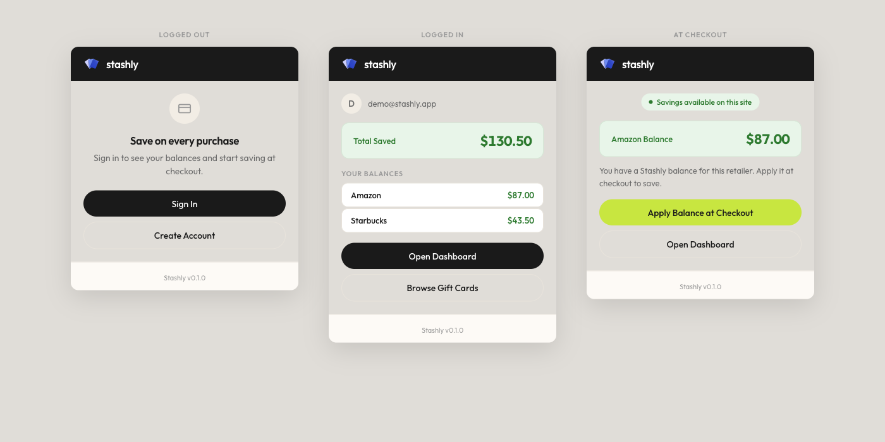

# Stashly

**Save on every purchase with stacked, discounted gift cards — applied automatically at checkout.**

Stashly is a gift card marketplace paired with a Chrome extension. Users buy brand gift cards below face value on the website; when they reach the checkout page of a supported retailer, the extension detects it, shows their available balance, and applies their gift cards for them. Buying a $1,000 MacBook with cards purchased at 8% off means paying ~$920 for the same order.



## How it works

1. **Buy** discounted gift cards on the Stashly web app (e.g. $100 Apple card for $92).
2. **Shop** normally at a supported retailer.
3. **Checkout detection** — the extension recognizes the checkout page, reads the cart total, and computes the optimal *stack* of card denominations to cover it.
4. **Apply** — one click fills the gift card fields. The user always places the order themselves; the extension never submits a purchase.

## Architecture

Monorepo with three deployable apps and a shared package:

```
apps/
├── extension/           Chrome extension (Manifest V3, vanilla JS)
│   ├── content/         Checkout detection, overlay UI, auto-apply
│   ├── background.js    Service worker: API relay, caching
│   └── popup/           Balances & savings summary
├── web/                 Next.js 15 app (marketplace, dashboard, admin)
│   ├── src/app/(app)/api/   REST endpoints: /stack, /purchase, /balances, …
│   ├── src/lib/stacking.ts  Greedy denomination-stacking algorithm
│   ├── src/services/payment/  Processor adapter pattern (Stripe test / Stax)
│   └── supabase/        Postgres migrations with row-level security
├── inventory-service/   Express + SQLite service holding card codes
│   ├── src/encryption.ts    AES-256-GCM at rest, key held only by this service
│   └── src/reservation.ts   Reserve → commit/release lifecycle
packages/shared/         Shared TypeScript types and constants
```

Design decisions worth noting:

- **Card codes live in one place.** The inventory service is a separate process on a private network; the web app talks to it over an authenticated internal API and never stores plaintext codes. Codes are AES-256-GCM encrypted at rest.
- **Reservation lifecycle.** Purchases reserve inventory first, then charge, then commit — a failed payment releases the reservation instead of leaking cards.
- **Minimal extension permissions.** The manifest requests host access only for the ten supported retailer domains, so the browser itself guarantees the extension cannot run anywhere else.
- **The extension never places orders.** Auto-apply fills gift card fields and stops. Submitting checkout is always a human action.
- **Payment processor abstraction.** Stripe prohibits gift card resale, so payments go through an adapter interface (`services/payment/`) — Stripe test keys for local development, a Stax adapter for production.
- **Demo mode.** `STASHLY_MODE=demo` serves mock inventory so the full flow can be demonstrated without live payment rails.

The full technical design — API contracts, KYC tiers, fraud/risk engine, checkout-detection scoring, trust zones, failure modes — is in **[docs/stashly-systems-design.md](docs/stashly-systems-design.md)** (20 sections). Earlier design and implementation plans live in [docs/plans/](docs/plans/).

## Running locally

```bash
npm install

# Web app (Next.js) — http://localhost:3000
cp .env.example apps/web/.env.local   # fill in Supabase keys, or set NEXT_PUBLIC_STASHLY_MODE=demo
npm run dev -w apps/web

# Inventory service — http://localhost:3511
npm run dev -w apps/inventory-service

# Extension: chrome://extensions → "Load unpacked" → apps/extension
```

Tests:

```bash
npm test -w apps/web                # stacking algorithm, payment API, webhook handler
npm test -w apps/inventory-service  # card reservation lifecycle
```

## Stack

Next.js 15 · React · TypeScript · Supabase (Postgres + Auth + RLS) · Express · SQLite · Chrome Manifest V3 · Vitest · Tailwind CSS

## Status & disclaimer

Portfolio / MVP project. Payments run in test mode only; live gift card sales require processor underwriting and the compliance framework described in the systems design doc. Brand names and logos belong to their respective owners and appear here solely to demonstrate the product concept.
