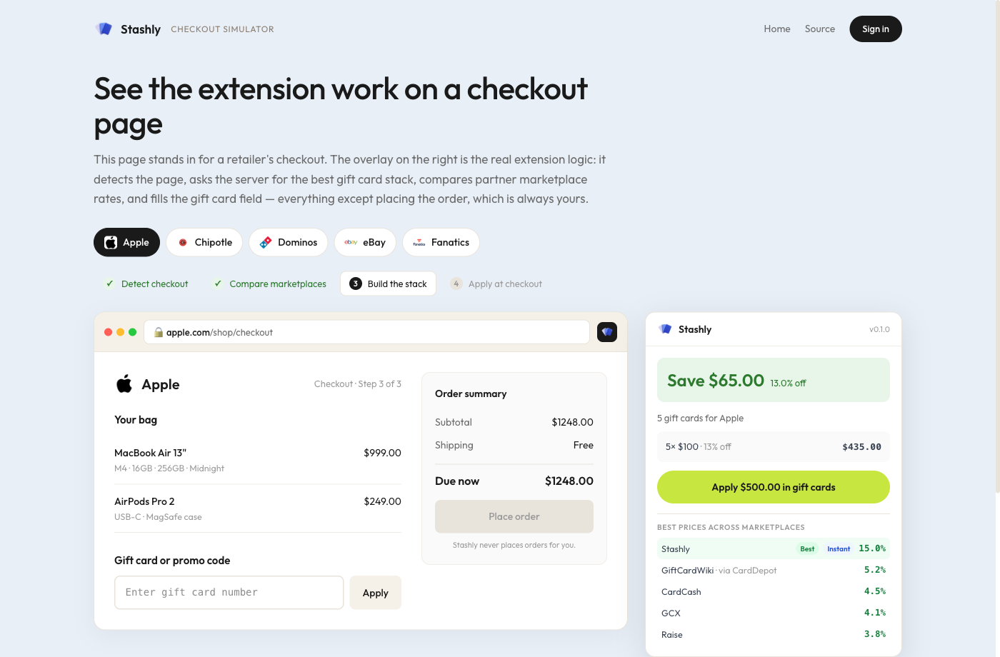

# Stashly

**Save on every purchase with stacked, discounted gift cards — applied automatically at checkout.**

Stashly is a gift card marketplace paired with a Chrome extension. Users buy brand gift cards below face value; when they reach the checkout page of a supported retailer, the extension detects it, compares rates across Stashly's inventory and partner marketplaces, and applies the best combination of cards for them. Buying a $1,000 MacBook with cards purchased at 8% off means paying ~$920 for the same order.

<p>
  <a href="https://stashly-alpha.vercel.app/demo"><strong>▶ Try the checkout simulator</strong></a> &nbsp;·&nbsp;
  <a href="https://stashly-alpha.vercel.app">Live site</a>
</p>



## Try it in two minutes

No install, no signup:

1. **[Open the checkout simulator](https://stashly-alpha.vercel.app/demo).** It stands in for a retailer's checkout page. Watch the extension overlay detect the page, compare marketplace rates, build a gift card stack, and fill the gift card field — everything except placing the order, which is always the user's action. Switch retailers at the top to rerun it. The stack and the rate comparison are computed server-side on every run by the same APIs the extension calls; the "Behind the scenes" panel shows each request and its latency.
2. **Open a demo account** from the [landing page](https://stashly-alpha.vercel.app) or the [login page](https://stashly-alpha.vercel.app/login). One click provisions an isolated, pre-seeded account (dashboard, purchase history, balances) and signs you in. Purchases run in demo mode — no card required, codes are clearly marked `DEMO-…`.

To run the real extension against retailer sites, load `apps/extension` unpacked in Chrome (`chrome://extensions` → Developer mode → Load unpacked) and point `apps/extension/utils/config.js` at the live API.


## How it works

1. **Buy** discounted gift cards on the Stashly web app (e.g. $100 Apple card for $92).
2. **Shop** normally at a supported retailer.
3. **Checkout detection** — the extension recognizes the checkout page, reads the cart total, and computes the optimal *stack* of card denominations to cover it.
4. **Price check** — rates are compared across Stashly inventory and partner marketplaces (CardCash, Raise, GCX, GiftCardWiki); the best deal is surfaced, whether it's ours or a link-out.
5. **Apply** — one click fills the gift card fields and presses the retailer's own *Apply* button. The user always places the order themselves; the extension never submits a purchase.

## Architecture

Monorepo with three deployable apps and a shared package:

```
apps/
├── extension/           Chrome extension (Manifest V3, vanilla JS)
│   ├── content/         Checkout detection, overlay UI, auto-apply
│   ├── background.js    Service worker: API relay, caching
│   └── popup/           Balances & savings summary
├── web/                 Next.js 16 app (marketplace, dashboard, admin) — deployed on Vercel
│   ├── src/app/(app)/api/   REST endpoints: /stack, /purchase, /balances, /rates, …
│   ├── src/app/demo/    Interactive checkout simulator
│   ├── src/lib/stacking.ts  Greedy denomination-stacking algorithm
│   ├── src/services/marketplace/  Hybrid rate aggregation (Stashly + partners)
│   ├── src/services/payment/  Processor adapter pattern (Stripe test / Stax)
│   └── supabase/        Postgres migrations with row-level security
├── inventory-service/   Express + SQLite service holding card codes
│   ├── src/encryption.ts    AES-256-GCM at rest, key held only by this service
│   └── src/reservation.ts   Stale-reservation expiry job
packages/shared/         Shared TypeScript types and constants
```

Design decisions worth noting:

- **Card codes live in one place.** The inventory service is a separate process on a private network; the web app talks to it over an authenticated internal API and never stores plaintext codes. Codes are AES-256-GCM encrypted at rest.
- **Reservation lifecycle.** Purchases reserve inventory first, then charge — a failed payment returns the reservation to the pool instead of leaking cards, and a background job expires stale holds.
- **Minimal extension permissions.** Host permissions and content-script injection are scoped to the eight supported retailer domains (plus Stashly itself) — the browser refuses to run the extension anywhere else.
- **The extension never places orders.** Auto-apply fills gift card fields and clicks the retailer's own apply button — never the order button. Submitting checkout is always a human action.
- **Hybrid marketplace model.** Every price surface compares Stashly inventory against partner marketplaces behind a provider-adapter interface — best rate wins, in-app when it's ours, affiliate link-out when it isn't. Partners run on demo fixtures until API agreements exist (no scraping); a failed provider drops out of the comparison instead of breaking it.
- **Payment processor abstraction.** Stripe prohibits gift card resale, so payments go through an adapter interface (`services/payment/`) — Stripe test keys for local development, a Stax adapter for production.
- **Demo accounts are isolated.** Each "try the demo" click provisions its own throwaway user (auto-confirmed, pre-seeded, pruned after 24h) via a service-role admin client, so evaluators never see each other's data and nobody can lock others out.
- **Demo mode.** `NEXT_PUBLIC_STASHLY_MODE=demo` serves mock inventory so the full flow can be demonstrated without live payment rails.

Design and implementation plans live in [docs/plans/](docs/plans/). The full systems design (API contracts, KYC tiers, fraud/risk engine, detection scoring, trust zones, failure modes) is kept private and available on request.

## Running locally

```bash
npm install

# Web app (Next.js) — http://localhost:3000
cp .env.example apps/web/.env.local   # fill in Supabase keys, or set NEXT_PUBLIC_STASHLY_MODE=demo
npm run dev -w apps/web

# Inventory service — http://localhost:3001
npm run dev -w apps/inventory-service

# Extension: chrome://extensions → "Load unpacked" → apps/extension
```

Tests:

```bash
npm test   # all suites: stacking, marketplace aggregation, payment API, webhooks, inventory reservations
```

## Stack

Next.js 16 · React · TypeScript · Supabase (Postgres + Auth + RLS) · Express · SQLite · Chrome Manifest V3 · Vitest · Tailwind CSS · Vercel

## Status & disclaimer

Portfolio / MVP project. Payments run in test mode only; live gift card sales require processor underwriting and the compliance framework described in the systems design doc. Brand names and logos belong to their respective owners and appear here solely to demonstrate the product concept.
